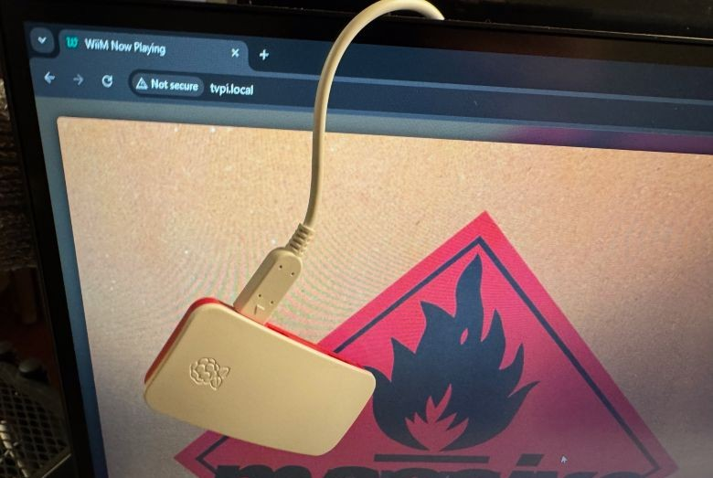

# Setting up a Raspberry Pi in headless mode

> **Warning**: [Goose chasing](https://www.urbandictionary.com/define.php?term=goose%20chase) ahead!!!  
The below 'manual' is by no means fool-proof as there are wildly different versions of RPi devices and OS'es abound.

**Goal**: Get the wiim-now-playing app running on a somewhat recent Raspberry Pi device, without direct display output i.e. 'headless'. The Pi can then be put away out of sight. The output will be shown by external devices through means of a browser (on a mobile phone, tablet, TV, other computer, another Raspberry Pi, ...).

Which type of Raspberry Pi should I use? [See the Raspberry Pi requirements.](RPi-Requirements.md)

> For setting up a Raspberry Device with a touchscreen see: [Setting up a Raspberry Pi in kiosk mode on a touchscreen](RPi-Setup.md)

Note: Although you can run the app on a headless Raspberry Pi Device, this would defeat the original purpose of the app a bit, as it was designed for touchscreen capabilities.

For example you can have a spare Raspberry Pi tucked away somewhere in a cupboard, running the wiim-now-playing server, in order to keep tabs on what your WiiM device is playing. And for the client to have a browser tab open all day. Possibly even using the cheapest Android tablet you can find.

It is however totally possible to hook up an external screen directly to the Raspberry Pi over HDMI. After following the instructions below, you should then also follow the Kiosk mode instructions in order to show the output to the attached screen. Note that you also would need to have a keyboard and mouse attached for any interaction with the display.

Then again you already should have the WiiM Home app on your mobile device (phone or tablet) to control and see what it is playing.

## Usage scenarios

**Scenario 1**: You want to see from across the room what your WiiM device is playing now. You do not fancy all the touchscreen stuff and just want to see it on your TV.

**Scenario 2**: You just want to get the now playing information anywhere there's a capable screen with a browser. For example as an extra browser tab on your laptop or repurposing an old tablet you were not really using anylonger.

## **The 'works-on-my-machine' short-hand-guide:**

1. Prepare a Raspberry Pi with or without any display attached. A display is not required for setup!  
2. Prepare a Raspberry Pi OS sd-card without a desktop i.e. the Lite version.  
   Make sure you can connect over the network, i.e. setup the Wifi during sd card initialisation.
3. Add the wiim-now-playing app over SSH.
4. Some Googling to fix 'this-and-that'.

For a more step-by-step process read below.

  
*An example of a Raspberry Pi Zero 2 W in headless configuration.  
With the now playing information shown in a browser in the background.*

## 1. Prepare an SD card with Raspberry Pi OS Lite

1. Use the [Raspberry Pi Imager](https://www.raspberrypi.com/software/) to download a version of Raspberry Pi OS **Lite**. As we won't be needing a full desktop environment.  
   First choose the Device you are going to use.  
   Then choose the OS. Depending on your choice of device you'll be listed the compatibel OSes. Click on Raspberry Pi OS (other). Pick the Raspberry Pi OS Lite version. The top one (64 bit - bookworm) will do fine.  
2. Choose your SD card. After selecting the SD card press Next. THis will ask you whether you would like to apply customisations. Choose Edit Settings:  
   
3. In the General tab set the hostname of your RPi. Keep it short, simple and unique, you'll thank yourself later. In the example below I've used _wnp.local_, feel free to name it anyway you like.  
   Please also set a username and password as you will need those to connect to and setup later.  
     
   Also, if you are going to use WiFi, this is the moment to tell the RPi those details.
4. In the Services tab select Enable SSH and use the default 'use password authentication'. Please remember the username and password you've set in the General tab!  
     
5. Now press Save and Click Yes to apply the customisations. Now create the SD card and wait for it to finish.
6. After finishing put the SD card in your RPi.

## 3. Configure your Raspberry Pi OS through SSH

After powering up the RPi with Raspberry Pi OS Lite you'll need to wait for it to initialise. Just let it settle a bit as during the first startup, after you've created the new SD card, the OS will need to prepare itself which will take some time.

Note: you can also connect a keyboard/mouse/computerscreen to the Raspbery Pi in order to conduct the next steps. But, presuming you already have a computer on which you've prepared the SD card, might as well use that to connect over SSH.

1. Start a command prompt. In these examples I am using PowerShell 7 on Windows 11. On a Mac you can use the Terminal.
2. You can make sure that the Raspberry Pi is up and running by using ```ping servername.local```, where servername is the name that you gave your Pi. If you get timeouts, it is still working on it or you did not insert the correct Wifi name or password. In the latter case you can remake the SD card with the Imager tool. Or if you're able connect the Pi with a network cable (and later on fix the Wifi).
3. At the command prompt type ``ssh username@servername.local``. Where ``username`` is **your username** that you've defined in the previous steps. And ``servername`` is the name you've set as your **hostname**.  
   In the example below I've used _caspar@wnp.local_.
     
4. At the first time connecting it will ask if you want to continue. Type ``yes`` and press Enter.
5. Every time we will connect to the RPi this question will no longer be asked. You can then use your password directly to connect:  
     
6. After connecting to your RPi over SSH you'll be greeted with a command prompt from the RPi server, like:  

   ```bash
   username@server:~ $
   ```

   Again, the username and servername are the ones you've defined earlier.  
   Congrats! It is working.

### Configure the RPi with sudo raspi-config

First we will configure and update the Raspberry Pi itself.

1. At the command prompt type:

   ```bash
   sudo raspi-config
   ```

2. You'll be greeted by the Software Configuration Tool menu:  
     
   _Use the arrow keys on your keyboard to navigate this menu_
3. From the menu select **1 System Options** > **S5 Boot / Auto Login**.  
   Select **B2 Console Autologin** to automatically login at the command prompt on startup.
4. Whether you need to set anything from **2 Display Options** or **3 Interface Options** is up to your specific hardware. Normally you would not need to set anything here. The same goes for options 4 and 5.  
   _However I've had one instance that I needed to set the 'WLAN Country' (under the Localisation Options) 2 times before it remembered it correctly and accepted the WiFi connection._
5. Under **6 Advanced Options** you may want to use **A1 Expand Filesystem**, in order for the entire capacity of the SD card to be recognised after reboot.
6. Choose **8 Update** to get all of the latest updates to the system, while you're at it.
7. Finally select Finish (arrow right key) and press Enter.

Maybe now is a good time to do a reboot of the RPi. Type at the command prompt:

```bash
sudo reboot
```

And wait for the Raspberry Pi to return to the command prompt, before you reconnect over ssh with.

```powershell
ssh username@server.local
```

## 4. Add the wiim-now-playing solution to the RPi

In order to host the wiim-now-playing solution we will need to install Node.js and NPM first! Do not use the default ``apt install`` method as it will install a very old version of Node.js, without NPM.

### Update all packages

Now that the Raspberry Pi is running it is a good idea to do an update of all the installed packages, and possibly any firmware.

1. Make an SSH connection to the RPi.
2. Run the following commands in sequence:

   ```bash
   sudo apt update
   sudo apt upgrade
   ```

   _If any new packages are found, install them! It may take a while at the first time._  
   _You may run these commands again, directly after or at any moment later, to make sure everything has been updated._  
   _Optionally, you also may do a restart of the Raspberry Pi with a ```sudo reboot``` after the upgrade of the packages is done_

### Installing Node.js LTS version

Refer to the <https://deb.nodesource.com/> installation instructions instead as it will install the latest LTS version (20.x) of Node.js.

1. Make an SSH connection to the RPi.
2. Run the following commands in sequence:

   ```bash
   curl -fsSL https://deb.nodesource.com/setup_20.x | sudo bash -
   sudo apt-get install -y nodejs
   ```

   _This will configure and install Node.js automatically on the device_

3. After the installation is done you can check whether the correct version of node and npm are installed. Running:  
   ``node -v`` should say version 20-something.  
   ``npm -v`` should say version 10-something.  
   _Higher is good, lower is bad._

### Installing Git

Installing the wiim-now-playing app can be as simple as downloading the zip from Github (using curl). Then unzip to a folder, run ``npm install`` and ``node server/index.js``. If so, skip the following Git steps, you're good to go. although you may miss the option to ```git pull``` any updates released afterwards.

In this case we'll be using Git to clone the wiim-now-playing repo in order to always be able to get the latest version easily.

1. Make an SSH connection to the RPi.
2. Git could already be installed with your Raspberry Pi OS.  
   Run the following command to install and make sure:  

   ```bash
   sudo apt install git
   ```

3. You can check wich version of Git you have gotten now:  
   ``git -v`` should tell you which version you have. Version 2.30-something or higher is fine.

### Install wiim-now-playing using Git

Now that we are sure that we have Git and Node.js available we can get the wiim-now-playing sources from Github and install it.

1. Make an SSH connection to the RPi.
2. Make sure that you are in your home folder. You can tell by the command prompt line showing a ~ (tilde) sign, like ``user@server:~ $``.  
   If not, then use ``cd ~`` to go to your home folder.  
   _If your are so inclined to put the files anywhere else, feel free to do so._
3. Run the following command to clone the wiim-now-playing repo:  

   ```bash
   git clone https://github.com/cvdlinden/wiim-now-playing.git
   ```

4. Then go into the wiim-now-playing folder using: ``cd wiim-now-playing/``.
5. Using ``ls -la`` will give you the contents of the folder. It should contain a bunch of files and folders, that correspond to the Github repo.
6. Before starting the wiim-now-playing app you need to tell it once to get all of the dependencies, using:  

   ```bash
   npm install
   ```

   _It may tell you about some vulnerabilities. Those can be ignored for now as they seem to not be infuential currently. Fixing those will break the app though._  
   _If it tells you there are errors, then please follow the instructions._

7. Now we can start the wiim-now-playing app in order to test if it works. Use:  

   ```bash
   node server/index.js
   ```

8. If you are lucky it will start without question.  
   If not, check the next chapter!

### Enable Node.js to run on port 80

By default Raspberry Pi Os (Debian) does not like claiming port 80, the default WWW server port, as a non-root user. In order to claim port 80 as a non-root/sudo user, use ([found here](https://stackoverflow.com/questions/60372618/nodejs-listen-eacces-permission-denied-0-0-0-080)):

```shell
sudo apt install libcap2-bin 
sudo setcap cap_net_bind_service=+ep `readlink -f \`which node\``
```

Now you can try and run the wiim-now-playing app by using:

```bash
node server/index.js
```

If this doesn't work then please change the port variable in ./server/index.js, using ``nano wiim-now-playing/server/index.js``.  
Good candidates for alternative ports are: 8000, 8080, 5000 or 3000. See what works best for you.

### Test the wiim-now-playing app

If you've started node correctly it will tell you it is running on 'localhost:80' or the likes.

1. Open up a browser tab on your computer.
2. Use the following address to see the app: ``servername.local``  
   Where servername is the hostname you set earlier. For example ``wnp.local``.
3. You should now see the app working:  
   .png)  
   Obviously you need to tell the Wiim device to play something first, use your WiiM Home app for that.

### Updating the app through Git

If there's a new version of the app you can easily update it through Git.

1. Make an SSH connection to the RPi.
2. Go into the wiim-now-playing folder: ``cd wiim-now-playing/``
3. Use the ``git pull`` command to get the latest version of the app.  
   It will tell you whether you already are up-to-date or automatically download the latest version/additions.
4. You can then go to the app settings and reload the UI to check the latest UI changes.  
   But for a proper update do a reboot (either ``sudo reboot`` or a 'Reboot Server' through the app).

Hint: Read up on git and its commands to get a grip on what else it can do, like skipping back to an earlier version or a different branch. Although definitely not required.

## 5. Autostart the wiim-now-playing app on boot

Whenever the RPi reboots, i.e. due to the intentional or unintentional loss of power, we would like to start the server/app automatically at startup. There are several methods for this to happen. Here's my version.

1. Make an SSH connection to the RPi.
2. We will use crontab to make the app start at every reboot. Use:  

   ```bash
   sudo crontab -e
   ```

   _If this is the first time it will ask which editor to use. My preference is the default, nano._

3. In the crontab text file add the following lines at the end:  

   ```bash
   # Start node on (re)boot
   @reboot su username -c "/usr/bin/node /home/username/wiim-now-playing/server/index.js" &
   ```

   _**NOTE!** Replace the 'username' with **your** username! Right after su **and** in /home/username/..._  
   _If you've placed the wiim-now-playing app in a different folder then ammend the last part to reflect the correct folder!_  
   _Note that the & at the end is required!_

4. Use CTRL+X -> Y to confirm -> Enter to confirm the filename.  
   The change will now be implemented.

5. You can check the changes by doing another ```sudo crontab -e```. You can see your edits at the end of the text.  
   Exit out of Nano like the first time.

To make sure, do a reboot (``sudo reboot``), wait for the RPi to come back up completely, open up a browser and point it to the RPi (i.e. ``servername.local``). It should now show you the wiim-now-playing app after each reboot.

If not, then redo the ``sudo crontab -e`` command to check if the rule you've set is correct.

Note: If the app looks garbled in the browser, please refresh your browser window i.e. clear your cache. If the issues persist, be patient and wait for things to settle. And/or try a power cycle of the Raspberry Pi by unplugging the powercord of the RPi completely, wait a while and then plug it back in.

Note: In the RPi commandline you can use ``top`` or ``htop`` to see if there is a node process running. It should be on _top_ of the list.

## Adding a screen to the HDMI port (optional)

The Raspberry Pi is now fully funtional with the wiim-now-playing app as long as you point a browser to it.

However there's not a lot to show for on the screen itself if you add a screen to the HDMI port. Just a command prompt at this point.

To add the same output as in the browser on an attached screen, please follow the [Enable Kiosk mode on a Raspberry Pi](RPi-Kiosk.md) instructions.
