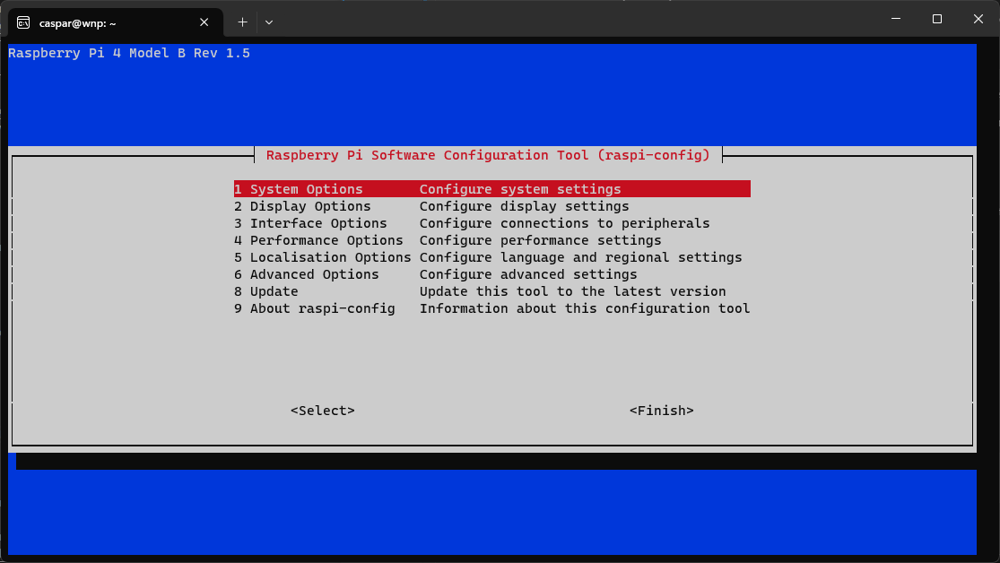
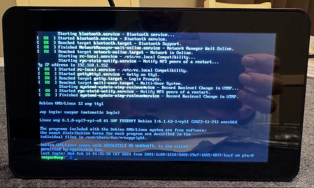
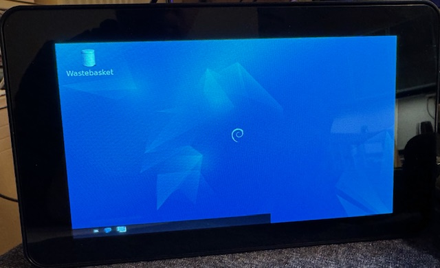
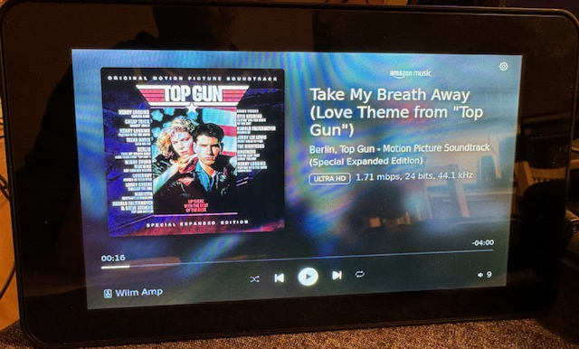

# Setting up a Raspberry Pi in kiosk mode on a touchscreen

> **Warning**: [Goose chasing](https://www.urbandictionary.com/define.php?term=goose%20chase) ahead!!!  
The below 'manual' is by no means fool-proof as there are wildly different versions of RPi devices and OS'es abound.

**Goal**: Start a somewhat recent Raspberry Pi device with browser in kiosk mode on the local (DSI) touchscreen display to show the wiim-now-playing app.

> Although you could run the app on a headless Raspberry Device! That would defeat the purpose a bit.  
  For example you can have a spare Raspberry Pi tucked away somewhere, running the wiim-now-playing server in order to keep tabs on what your WiiM device is playing. Possibly even a Pi Zero, haven't tested that yet  
  And for the client to have a browser tab open all day. Possibly even using the cheapest Android tablet you can find.  
  Then again you already should have the WiiM Home app on your device to control and see what it is playing.

**Scenario 1**: You want to have a passive screen on your desk or near your stereo, that when something catches your ears you want to know what it is that is playing now.

**Scenario 2**: You work from home, having some nice tunes playing to keep you company/focussed. Then suddenly you are interrupted, like someone calling, and you want to mute/pause the WiiM device immediately.  
I.e. faster than reaching for your phone, opening the WiiM Home app and pause. Or reach for your amp and turn down the volume.

**Scenario 3**: You are going through some playlists while hanging back. Then you're not into one song and want to skip quickly. Or you want to play that song again.

**The 'works-on-my-machine' short-hand-guide:**

1. Prepare a Raspberry Pi with an attached touchscreen.  
   Make sure you know how to activate the screen before anything else.  
   Test with a regular RPi OS to see if the screen works (both video and touch).
2. Prepare a Raspberry Pi OS (Bullseye - legacy) sd-card without a desktop.  
   Make sure you can see a command prompt on the touchscreen.
3. Install the 'Lite' version with LXDE (see the blockdev.io link) is advised.  
   Note: LightDM apparently does not like autologin and the Fat version is overkill.
4. Add the chromium-browser with minimal desktop dependencies (LXDE).
5. Whole lot of Googling to fix 'this-and-that'.  

For a more step-by-step process read below.

## 1. Prepare a Raspberry Pi with a touchscreen

First, make sure that your touchscreen works properly i.e. you have an image output and the touch input works.

1. Connect you Raspberry Pi to the touchscreen by following the instructions of the manufacturer.
2. Grab a copy of [Raspberry Pi OS](https://www.raspberrypi.com/software/), with the desktop, to check whether your RPi works with the screen attached. Use the [Raspberry Pi Imager](https://www.raspberrypi.com/software/) to download and write the OS to an SD card and insert the card into you RPi.
3. If the screen displays the Raspberry Pi OS Desktop, you are good to go.  
   If it doesn't display a desktop, please follow the manufacturers manual in order to activate the screen. You may need additional drivers for screen output.  
   Please take note of the instructions to enable the display as you will need them again later.

## 2. Prepare an SD card with Raspberry Pi OS Lite

Depending on the previous results you could use the latest version of RPi OS, Bookworm (February 2024). However it may not play very nice with some touchscreens. Read the screen manufacturers documentation to see if it can be enabled on the latest OS version.

Otherwise try the legacy version (Bullseye) or older. Reverting to Bullseye seems a safe option if you run into trouble.

1. Use the [Raspberry Pi Imager](https://www.raspberrypi.com/software/) to download a version of Raspberry Pi OS **Lite**. As we won't be needing a full desktop environment.
2. Choose your SD card, the one you've previously used to test your screen. After selecting the SD card to use, it will ask you whether you would like to apply customisations. Choose Edit Settings:  
   
3. In the General tab set the hostname of your RPi. Keep it short, simple and unique, you'll thank yourself later. In the example below I've used _wnp.local_, feel free to name it anyway you like.  
   Please also set a username and password as you will need those to connect to and setup later.  
     
   Also, if you are going to use WiFi, this is the moment to tell the RPi those details.
4. In the Services tab select Enable SSH and use the default 'use password authentication'. Please remember the username and password you've set in the General tab!  
     
5. Now press Save and Click Yes to apply the customisations. Now create the SD card and wait for it to finish.
6. After finishing put the SD card in your RPi.

## 3. Configure your Raspberry Pi OS through SSH

After powering up the RPi with Raspberry Pi OS Lite you'll find yourself at a command prompt or a blank screen. Just let it settle a bit as during the first startup, after you've created the new SD card, the OS will prepare itself which will take some time.

Note: you can also connect a keyboard/mouse/computerscreen to the Raspbery Pi in order to conduct the next steps. But, presuming you already have a computer on which you've prepared the SD card, might as well use that to connect over SSH.

1. Start a command prompt. In these examples I am using PowerShell 7 on Windows 11. On a Mac you can use the Terminal.
2. At the command prompt type ``ssh username@servername.local``. Where ``username`` is **your username** that you've defined in the previous steps. And ``servername`` is the name you've set as your **hostname**.  
   In the example below I've used _caspar@wnp.local_.
     
3. At the first time connecting it will ask if you want to continue. Type ``yes`` and press Enter.
4. Every time we will connect to the RPi this question will no longer be asked. You can then use your password directly to connect:  
     
5. After connecting to your RPi over SSH you'll be greeted with a command prompt from the RPi server, like:  

   ```bash
   username@server:~ $
   ```

   Again, the username and servername are the ones you've defined earlier.  
   Congrats! It is working.

### Configure the RPi with sudo raspi-config

First we will configure and update the Raspberry Pi itself.

1. At the command prompt type:

   ```bash
   sudo raspi-config
   ```

2. You'll be greeted by the Software Configuration Tool menu:  
     
   _Use the arrow keys on your keyboard to navigate this menu_
3. From the menu select **1 System Options** > **S5 Boot / Auto Login**.  
   Select **B2 Console Autologin** to automatically login at the command prompt on startup.
4. Whether you need to set anything from **2 Display Options** or **3 Interface Options** is up to your specific hardware. Normally you would not need to set anything here. The same goes for options 4 and 5.  
   _However I've had one instance that I needed to set the 'WLAN Country' (under the Localisation Options) 2 times before it remembered it correctly and accepted the WiFi connection._
5. Under **6 Advanced Options** you may want to use **A1 Expand Filesystem**, in order for the entire capacity of the SD card to be recognised after reboot.
6. Choose **8 Update** to get all of the latest updates to the system, while you're at it.
7. Finally select Finish (arrow right key) and press Enter.

Maybe now is a good time to do a reboot of the RPi. Type at the command prompt:

```bash
sudo reboot
```

And wait for the Raspberry Pi to return to the command prompt, before you reconnect over ssh with.

```powershell
ssh username@server.local
```

### Configure the touchscreen

At this step you still may not have an image on your touchscreen display. Please have a look at the manufacturers documentation in order to enable the display through the command prompt. You may need to configure some drivers of config files.

In my example I'm using a Raspberry Pi 4 with the official Raspberry Pi touchscreen. And if you're familiar with those, the screen output is upside-down by default. So let's rectify that. For this we refer to [Changing the screen orientation](https://www.raspberrypi.com/documentation/accessories/display.html#changing-the-screen-orientation) documentation by Raspberry Pi.

1. Connect to the Raspberry Pi over SSH: ``ssh username@servername.local``
2. Start editing the cmdline.txt file by typing at the command prompt:  

   ```bash
   sudo nano /boot/firmware/cmdline.txt
   ```

3. At the end of the line add:

   ```bash
    video=DSI-1:800x480@60,rotate=180
   ```

   **NOTE: there is a space before video= and after anything that is already on that line!**  
   _We will use rotate=180 to put the display the right way up._

4. Use CTRL+X -> Y to confirm -> Enter to confirm the filename.  
   The display rotation change should now have been set.
5. However the touch input should also be rotated. Type the following to edit the config.txt file:

   ```bash
   sudo nano /boot/firmware/config.txt
   ```

6. Find the line that says ``display_auto_detect=1``. Add a # in front to comment out that line.  
   Then add a line that says ``dtoverlay=vc4-kms-dsi-7inch,invx,invy``. So that it looks like this:  
   
7. Then use CTRL+X -> Y to confirm -> Enter to confirm the filename.
8. In order for these changes to take effect we need to do a reboot:

   ```bash
   sudo reboot
   ```

Wait for the RPi to reboot. It may start upside-down first, but it will right itself eventually...



**Success!**

## Add the wiim-now-playing solution to the RPi

In order to host the wiim-now-playing solution we will need to install Node.js and NPM first! Do not use the default ``apt install`` method as it will install a very old version of Node.js, without NPM.

### Installing Node.js LTS version

Refer to the <https://deb.nodesource.com/> installation instructions instead as it will install the latest LTS version (20.x) of Node.js.

1. Make an SSH connection to the RPi.
2. Run the following commands in sequence:

   ```bash
   sudo apt update
   sudo apt upgrade
   ```

   _If any new packages are found, install them! It may take a while at the first time._  
   _You may run these commands again to make sure everything has been updated._

3. Now add the following packages:

   ```bash
   sudo apt install -y ca-certificates curl gnupg
   ```

   _It may tell you that the packages already have been installed._

4. Run the following command to add the nodesource repo:  

   ```bash
   curl -fsSL https://deb.nodesource.com/gpgkey/nodesource-repo.gpg.key | sudo gpg --dearmor -o /etc/apt/keyrings/nodesource.gpg
   ```

5. Next run the following to add nodesource to the sources list:  

   ```bash
   NODE_MAJOR=20
   ```

   and

   ```bash
   echo "deb [signed-by=/etc/apt/keyrings/nodesource.gpg] https://deb.nodesource.com/node_$NODE_MAJOR.x nodistro main" | sudo tee /etc/apt/sources.list.d/nodesource.list
   ```

6. Now it is time to install Node.js with the following commands:  

   ```bash
   sudo apt update
   sudo apt install nodejs -y
   ```

7. After the installation is done you can check whether the correct version of node and npm are installed. Running:  
   ``node -v`` should say version 20-something.  
   ``npm -v`` should say version 10-something.  
   _Higher is good, lower is bad._

### Installing Git

Installing the wiim-now-playing app can be as simple as downloading the zip from Github (using curl). Then unzip to a folder, run ``npm install`` and ``node server/index.js``. If so, skip the following Git steps, you're good to go.

In this case we'll be using Git to clone the wiim-now-playing repo in order to always be able to get the latest version easily.

1. Make an SSH connection to the RPi.
2. Git could already be installed with your Raspberry Pi OS.  
   Run the following command to install and make sure:  

   ```bash
   sudo apt install git
   ```

3. You can check wich version of Git you have gotten now:  
   ``git -v`` should tell you which version you have. Version 2.30-something or higher is fine.

### Install wiim-now-playing using Git

Now that we are sure that we have Git and Node.js available we can get the wiim-now-playing sources from Github and install it.

1. Make an SSH connection to the RPi.
2. Make sure that you are in your home folder. You can tell by the command prompt line showing a ~ (tilde) sign, like ``user@server:~ $``.  
   If not, then use ``cd ~`` to go to your home folder.  
   _If your are so inclined to put the files anywhere else, feel free to do so._
3. Run the following command to clone the wiim-now-playing repo:  

   ```bash
   git clone https://github.com/cvdlinden/wiim-now-playing.git
   ```

4. Then go into the wiim-now-playing folder using: ``cd wiim-now-playing/``.
5. Using ``ls -la`` will give you the contents of the folder. It should contain a bunch of files and folders, that correspond to the Github repo.
6. Before starting the wiim-now-playing app you need to tell it once to get all of the dependencies, using:  

   ```bash
   npm install
   ```

   _It may tell you about some vulnerabilities. Those can be ignored for now as they seem to not be infuential currently. Fixing those will break the app though._  
   _If it tells you there are errors, then please follow the instructions._

7. Now we can start the wiim-now-playing app in order to test if it works. Use:  

   ```bash
   node server/index.js
   ```

8. If you are lucky it will start without question.  
   If not, check the next chapter!

### Enable Node.js to run on port 80

By default Raspberry Pi Os (Debian) does not like claiming port 80, the default WWW server port, as a non-root user. In order to claim port 80 as a non-root/sudo user, use ([found here](https://stackoverflow.com/questions/60372618/nodejs-listen-eacces-permission-denied-0-0-0-080)):

```shell
sudo apt install libcap2-bin 
sudo setcap cap_net_bind_service=+ep `readlink -f \`which node\``
```

Now you can try and run the wiim-now-playing app by using:

```bash
node server/index.js
```

If this doesn't work then please change the port variable in ./server/index.js, using ``nano wiim-now-playing/server/index.js``.  
Good candidates for alternative ports are: 8000, 8080, 5000 or 3000. See what works best for you.

### Test the wiim-now-playing app

The Raspberry Pi will not show any app yet on its screen, as we haven't configured it yet. However if you've started node correctly it will tell you it is running on 'localhost:80'.

1. Open up a browser on your computer.
2. Use the following address to see the app: ``servername.local``  
   Where servername is the hostname you set earlier. For example ``wnp.local``.
3. You should now see the app working:  
   .png)  
   Obviously you need to tell the Wiim device to play something first, use your WiiM Home app for that.

### Updating the app through Git

If there's a new version of the app you can easily update it through Git.

1. Make an SSH connection to the RPi.
2. Go into the wiim-now-playing folder: ``cd wiim-now-playing/``
3. Use the ``git pull`` command to get the latest version of the app.  
   It will tell you whether you already are up-to-date or automatically download the latest version/additions.
4. You can then go to the app settings and reload the UI to check the latest UI changes.  
   But for a proper update do a reboot (either ``sudo reboot`` or a 'Reboot Server' through the app).

Note: Read up on git and its commands to get a grip on what else it can do, like skipping back to an earlier version. Although definitely not required.

## Autostart the wiim-now-playing app on boot

Whenever the RPi reboots, i.e. due to the intentional or unintentional loss of power, we would like to start the server/app automatically at startup. There are several methods for this to happen. Here's my version.

1. Make an SSH connection to the RPi.
2. We will use crontab to make the app start at every reboot. Use:  

   ```bash
   sudo crontab -e
   ```

   _If this is the first time it will ask which editor to use. My preference is the default, nano._

3. In the crontab text file add the following lines at the end:  

   ```bash
   # Start node on (re)boot
   @reboot su username -c "/usr/bin/node /home/username/wiim-now-playing/server/index.js" &
   ```

   _Replace the 'username' with **your** username! Right after su and in /home/username/..._  
   _If you've placed the wiim-now-playing app in a different folder then ammend the last part to reflect the correct folder!_  
   _Note that the & at the end is required!_

4. Use CTRL+X -> Y to confirm -> Enter to confirm the filename.  
   The change will now be implemented.

To make sure, do a reboot (``sudo reboot``), wait for the RPi to come back up completely, open up a browser and point it to the RPi (i.e. ``servername.local``). It should now show you the wiim-now-playing app after each reboot.

If not, then redo the ``sudo crontab -e`` command to check if the rule you've set is correct.

Note: If the app looks garbled in the browser, try a power cycle. Unplug the RPi completely, wait and then plug it in again.

Note: In the RPi commandline you can use ``top`` or ``htop`` to see if there is a node process running. It should be on _top_ of the list.

## Chromium-browser in Kiosk mode

Now that we've configured the RPi and the wiim-now-playing app (server part) to run every time the RPi (re)boots, we would like to show the client on the touchscreen as well.

### Configuring Kiosk mode

For this we need to get the chromium-browser to also start automatically in kiosk mode and point to the wiim-now-playing app.

1. Make an SSH connection to the RPi.
2. Install the chromium-browser and some basic desktop functionality (LXDE) by using the following commands to install the required applications:

   ```bash
   sudo apt install chromium-browser
   sudo apt install unclutter
   sudo apt install lxde
   ```

   _Note: This will take a while! If your SSH connection is broken off, please wait a while before reconnecting. Just let it do its thing._  
   _Note: If the RPi stays unresponsive for a long time it may take a power off from the RPi to return to normal operation._

3. Once you can reconnect, then change the startup behaviour by opening ```sudo raspi-config```.
4. From the menu select **1 System Options** > **S5 Boot / Auto Login**.  
   Select **B2 Desktop Autologin** to automatically start the Desktop GUI.  
   Finish and reboot.
5. You will now be greeted by a desktop environment on the RPi display instead of a command prompt.

   

6. Reconnect to the RPi through SSH and use the following command to edit the LXDE autostart file:

   ```bash
   sudo nano .config/lxsession/LXDE/autostart
   ```

7. Edit the autostart file by commenting out all of the lines already present.  
   Add a line at the end like ``@/home/username/autostart.sh``.  
   Replace username with **your** username!

   ```bash
   #@lxpanel --profile LXDE
   #@pcmanfm --desktop --profile LXDE
   #@xscreensaver -no-splash

   @/home/username/autostart.sh
   ```

8. Then use CTRL+X -> Y to confirm -> Enter to confirm the filename.
9. Next we will create and edit the autostart.sh file. Use:

   ```bash
   nano autostart.sh
   ```

   _Note that sudo is not required!_

10. Add the following lines to the autostart.sh file:  

    ```bash
    #!/bin/bash

    # Start chromium-browser in Kiosk mode
    sed -i 's/"exited_cleanly": false/"exited_cleanly": true/' ~/.config/chromium/Default/Preferences
    chromium-browser --app=http://localhost --kiosk --noerrdialogs --incognito --hide-scrollbars --no-first-run

    exit 0
    ```

11. Then use CTRL+X -> Y to confirm -> Enter to confirm the filename.
12. Before we do a reboot we need to make autostart.sh executable, use:

    ```bash
    chmod +x autostart.sh
    ```

13. Now do a reboot (``sudo reboot``) of the RPi.
14. Wait for the RPi to reboot. This may take a while...  

    

    _Note: If the screen looks garbled, wait a while for it to settle. Or try a power cycle by unplugging the RPi completely, wait and then plug it in again._  
    _It may also help to have the RPi connected through an Ethernet cable._

### Screensaver

Unfortunately the OS still has a screensaver/-blanking enabled. After a while your screen will go blank. If you always want to have the screen turned on, add the following lines at the beginning of the autostart.sh file:

```bash
# Screen always on
xset s off
xset -dpms
xset s noblank
```

Now, if like me, you want to have the screen only turned on for a limited amount of time and not light up the room 24/7, here are some alternative steps:

1. Connect to the RPi through SSH.
2. Edit the autostart file:

   ```bash
   nano autostart.sh
   ```

3. Add the following lines to the autostart file, just below the ``#!/bin/bash`` line:

   ```bash
   # Set screensaver/blanking to black background
   xset -dpms
   xset s noblank
   xset s 900 900
   ```

   _The -dpms disables the Display Power Management, effectively stopping modern power management from interrupting._
   _The noblank statement makes sure that no signals are cut from the display. Some screens do not like being cut off and show an 'not connected' message/colorspectrum. Which defeats the purpose._
   _The 900 stands for 900 seconds i.e. 15 minutes. Feel free to change to any timespan you'd like._

### Screen(saver) locking

...

### Blank screen background

...

---

Useful links to get kiosk mode working:

- Fat, Lite and Super Lite versions: <https://blockdev.io/raspberry-pi-2-and-3-chromium-in-kiosk-mode/>
- <https://www.raspberrypi.com/tutorials/how-to-use-a-raspberry-pi-in-kiosk-mode/>
- <https://reelyactive.github.io/diy/pi-kiosk/>
- <https://github.com/guysoft/FullPageOS>

**Note**: Your mileage may vary.

## Additional info

### Screensaver and lock screen

You can set the RPi to never fall asleep. If you so require, do so.

But if you just want to let the screen go dark and wake up on touch...  
Tell it to ignore the screensaver or use ``sudo apt remove xscreensaver``.
This does not get rid of the lock screen after the screensaver. On how to do that, use your friend Google, and prepare for a long night.
